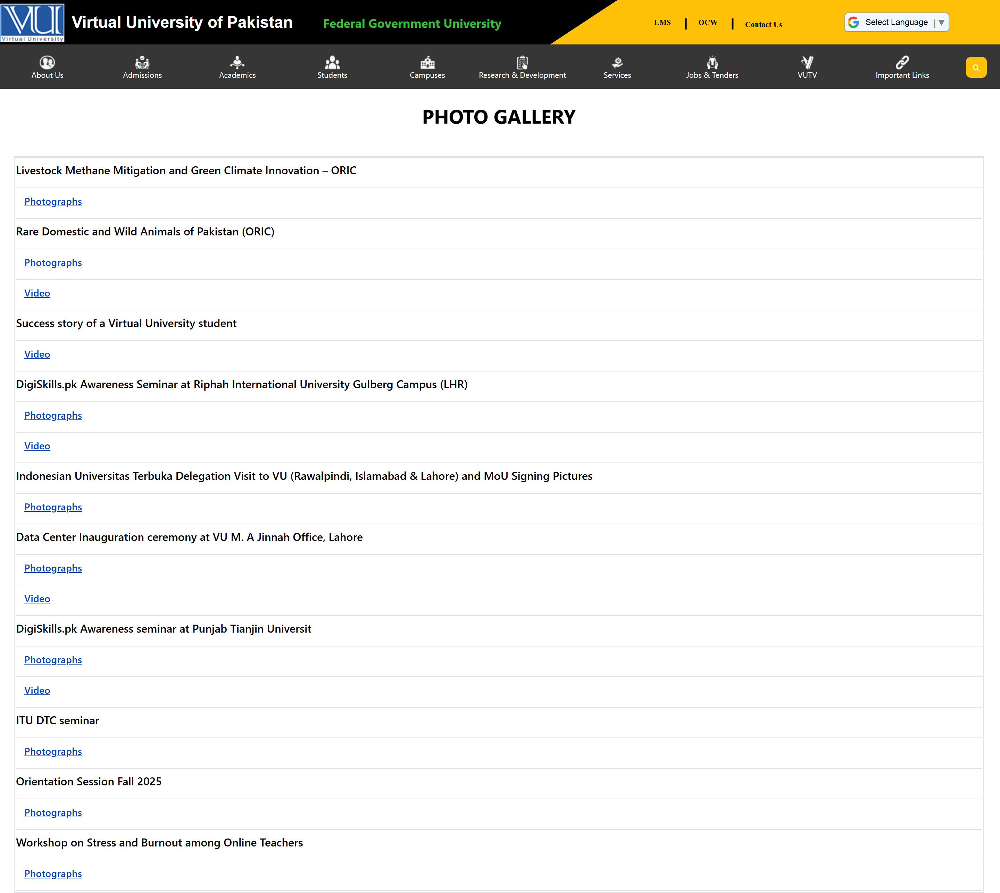

# Virtual University Photo Gallery

A frontend recreation of the Virtual University of Pakistan Photo Gallery interface, built with HTML5 and CSS3. The project recreates the university branding header, navigation menu, hover-based dropdowns, language selector, search interface, and photo gallery layout.

## Table of Contents

- [Overview](#overview)
- [Live Demo](#live-demo)
- [Reference Preview ](#reference-preview)
- [Features](#features)
- [Technologies Used](#technologies-used)
- [Implementation](#implementation)
- [Project Structure](#project-structure)
- [Run Locally](#run-locally)
- [References](#references)
- [Author](#author)

## Overview

This project recreates the visual structure of the Virtual University of Pakistan Photo Gallery page using HTML and CSS.

The interface includes a two-section header with Virtual University branding, quick links such as LMS, OCW, and Contact Us, followed by a secondary navigation bar containing category icons and hover-based dropdown menus.

The main content presents a Photo Gallery section with event titles and links to photographs and videos. The original page structure includes categories such as About Us, Admissions, Academics, Students, Campuses, Research & Development, Services, Jobs & Tenders, VUTV, and Important Links.

## Live Demo


[](https://hadiashah01.github.io/clone-VU-gallery/)

> Click the preview image to open the live project.

## Reference Preview

Below are a few screenshots showing the preview of the cloned webpage design:  

  


## Features

- Virtual University-inspired header and branding
- Two-section header with black and yellow visual design
- LMS, OCW, and Contact Us navigation links
- Category-based navigation menu
- Hover-based dropdown menus
- About Us, Admissions, Academics, Students, Campuses, Research & Development, Services, Jobs & Tenders, VUTV, and Important Links sections
- Language selector interface
- Search interface
- Photo Gallery content section
- Photograph and video links
- CSS-based layout and visual styling

## Technologies Used

- **HTML5** — Page structure and content
- **CSS3** — Styling, positioning, hover states, and visual effects
- **Flexbox** — Header and navigation layout
- **CSS `clip-path`** — Angled yellow header design

## Implementation

### Header Layout

The header is divided into black and yellow sections using Flexbox:

```css
.top {
  background-color: #000;
}

.top__black {
  width: 55%;
}

.top__yellow {
  width: 45%;
}
```

### Angled Header Design

The yellow section uses CSS `clip-path` to create its angled visual shape:

```css
.yellow-bg {
  background-color: #ffc107;
  clip-path: polygon(15% 0, 100% 0, 100% 100%, 0 100%);
}
```

### Navigation Dropdowns

The navigation dropdowns are hidden by default and displayed when the user hovers over the corresponding navigation item:

```css
.dropdown {
  display: none;
}

.icon_wrap:hover .dropdown {
  display: flex;
}
```

### Gallery Layout

The main gallery section uses a table-based structure containing event titles and links to photographs or videos.

## Project Structure

```text
clone-VU-gallery/
│
├── images/
├── index.html
├── style.css
└── README.md
```

## Run Locally

1. Clone the repository:

```bash
git clone https://github.com/hadiashah01/clone-VU-gallery.git
```

2. Navigate to the project directory:

```bash
cd clone-VU-gallery
```

3. Open `index.html` in your browser.

## References

- [Virtual University of Pakistan - Photo Gallery](https://www.vu.edu.pk/photogallery/Default)
- [MDN — CSS `clip-path`](https://developer.mozilla.org/en-US/docs/Web/CSS/clip-path)
- [MDN — CSS Flexible Box Layout](https://developer.mozilla.org/en-US/docs/Web/CSS/CSS_flexible_box_layout)
- [MDN — CSS `:hover` pseudo-class](https://developer.mozilla.org/en-US/docs/Web/CSS/:hover)
- [MDN — HTML `<table>` element](https://developer.mozilla.org/en-US/docs/Web/HTML/Reference/Elements/table)

## Author

**Hadia Shahjahan**

- GitHub: [@hadiashah01](https://github.com/hadiashah01)
- LinkedIn: [Hadia Shahjahan](https://www.linkedin.com/in/hadia-shahjahan/)


If you found this project useful, feel free to explore the repository and connect with me on GitHub or LinkedIn.